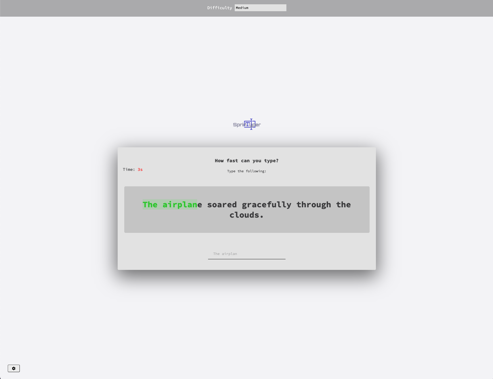
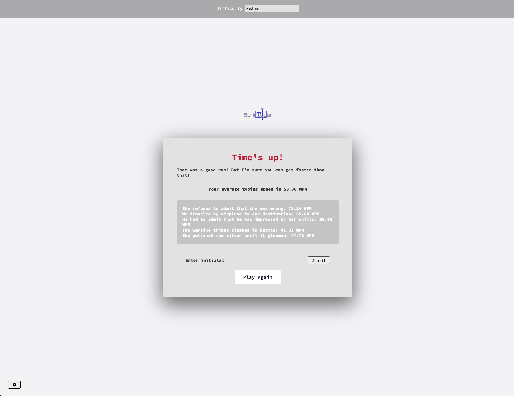

# Speed-Typer

## Description

Speed-Typer is a game-based tool designed to enhance hand dexterity and typing speed. This project aims to provide an enjoyable and interactive way to practice typing skills while also improving the speed and accuracy of keyboard input.

**Motivation:**
In today's digital world, typing is essential for communication, work, and education. There's a growing need for efficient and accurate typing, making a dedicated practice tool highly valuable. Traditional typing practice can be monotonous, but Speed-Typer makes it fun and engaging through game-based learning, encouraging consistent practice and faster skill development.

**Problem Solved:**
Speed-Typer addresses the need for an engaging and effective tool to improve typing skills. It transforms traditional, monotonous typing practice into an enjoyable experience, motivating users to practice consistently and track their progress over time.

**Learnings:**
Developing Speed-Typer provided valuable insights into:

- Core JavaScript concepts such as event handling and asynchronous operations.
- Complex mathematical logic and sophisticated array manipulation for efficient algorithm creation.
- Managing data with localStorage to store user preferences, difficulty settings, and scores for a personalised user experience.

## Features

- **Game-Based Interface**: Engage in a fun and interactive typing game environment.
- **Typing Challenges**: Take on various typing challenges designed to push your limits and improve your typing speed.
- **Real-Time Feedback**: Receive instant feedback on your typing performance to track your progress and identify areas for improvement.
- **Customisable Settings**: Tailor the game to your preferences with customizable difficulty levels, time limits, and typing exercises.
- **Multiplayer Mode**: Locally compete with friends to see who can achieve the highest typing speed and accuracy.

## **Demo**






## Installation

To install and set up Speed-Typer locally, follow these steps:

1. **Clone the repository:**
   ```bash
   git clone https://github.com/yourusername/speed-typer.git
   ```
2. **Navigate to the project directory:**
   ```bash
   cd speed-typer
   ```
3. **Open the `index.html` file in your browser:**
   - You can open it directly by double-clicking the file or using your IDE's live server extension.

## Usage

1. **Launch the Application:**
   - Follow the installation instructions to open the application in your browser.
2. **Select Difficulty:**

   - Choose a difficulty level if not already selected.

3. **Start Typing:**

   - Begin typing the displayed text as accurately and quickly as possible.

4. **Receive Feedback:**

   - Get real-time feedback on your typing speed.

5. **Submit your Highscore for that difficulty**

   - Get competitive by putting your name on the leaderboard.

6. **Practice Continuously:**

   - Keep practicing to improve your typing skills over time.

7. **Level Up:**
   - Move to higher difficulty levels as you gain confidence and speed.

## Contributing

Contributions are welcome! If you have any ideas for new features, improvements, or bug fixes, please submit a pull request or open an issue on GitHub.

#### How to Contribute

1. Fork the repository.
2. Create a new branch: `git checkout -b feature/your-feature`
3. Commit your changes: `git commit -m 'Add some feature'`
4. Push to the branch: `git push origin feature/your-feature`
5. Open a pull request.

## License

This project is licensed under the MIT License - see the [LICENSE](LICENSE) file for details.

## Contact

For any inquiries or feedback, please contact [joshuaecapito22@gmail.com](mailto:joshuaecapito22@gmail.com).
